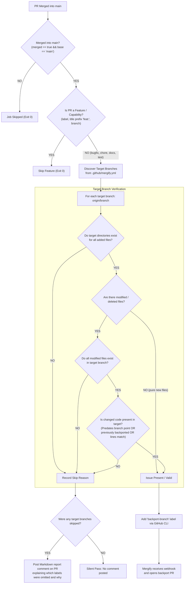

# Github workflow on moveit2 repository

## Automated Mergify labeling for backporting
### Description

This workflow provides an automated backport qualification and labeling mechanism for pull requests merged into `main`. It eliminates the reliance on manual maintainer labeling, accelerating bug fix delivery to stable release branches while preventing broken backports on incompatible branches.

#### Key Features

1. Instant, automated labeling upon merge: 
   - Triggers immediately when a PR is merged into `main`.
   - Automatically attaches `backport-<branch>` labels so that [Mergify](https://mergify.com) ([`mergify.yml`](../mergify.yml)) can seamlessly open backport pull requests.
1. Dynamic target branch discovery (No Hardcoding):
   - Automatically derives active backport target branches directly from [`.github/mergify.yml`](../mergify.yml) and validates them against remote heads on `origin`.
      - Requires zero maintenance of the backport target branches (The added feature relies on `mergify.yml` for that).
1. Issue-presence verification:
   - Before attaching any backport label, determine whether the problem or code being patched actually exists in the target branch.
   - Prevents blind backports that result in merge conflicts or dump incompatible modern code into older branches.
1. Communicate the result of backport decision:
   - If a target branch is skipped because backporting the changes in the PR is not applicable, a comment is posted detailing which backport labels were omitted and why.

#### Logic flow

#### Decision points
1. Merge & branch guardrails:
   - Evaluates strictly when `github.event.pull_request.merged == true` and `base.ref == 'main'`.
   - Closed unmerged PRs are completely skipped before any runner is provisioned.
1. Feature vs. non-feature classification:
   - Identifies and excludes feature PRs by checking:
     - Feature labels (`enhancement`, `feature`, `feature-request`, `epic`, `roadmap`).
     - Conventional commit title prefixes (`feat:`, `feat(...)`, `feature:`, `[feature]`).
     - Branch naming (`feat/*`, `feature/*`).
     - Automated PRs (existing `(backport #...)` PRs, `mergify[bot]`, and release PRs).
   - Bug fixes, documentation updates, test improvements, and maintenance PRs proceed to target evaluation.
1. Problem-presence verification:
   - Target directory check for added files: For any newly added files (not limited to e.g. new unit tests or documentation), ensures their destination directory exists on the target branch. Pure new-file additions to existing directories are approved immediately.
   - File existence check for modified files: For modified (`M`) or deleted (`D`) files, verifies that the file exists in the target branch.
   - Code ancestry & backport history check: Uses `git blame` and `git merge-base` on lines removed or modified by the PR to determine when they were introduced in `main`:
     - If the code predates the target branch split, it was inherited when the branch was created.
     - If the code was committed *after* the target branch split, the Action checks whether that introducing commit (or its originating PR) was **previously backported** to the target branch (via cherry-pick logs or backport PR metadata) and verifies that the lines exist in the target file.
     - If the code post-dates the branch point and was never backported to the target branch, it confirms that the target branch never had this code or defect, safely skipping the label.
1. Complementary integration with `Mergify`:
   - Does not duplicate Mergify's cherry-picking or PR creation mechanisms. Instead, the Action acts as the qualification engine, applying the appropriate `backport-<branch>` label, which triggers Mergify to handle the actual branch creation and backport PR opening.

EoF